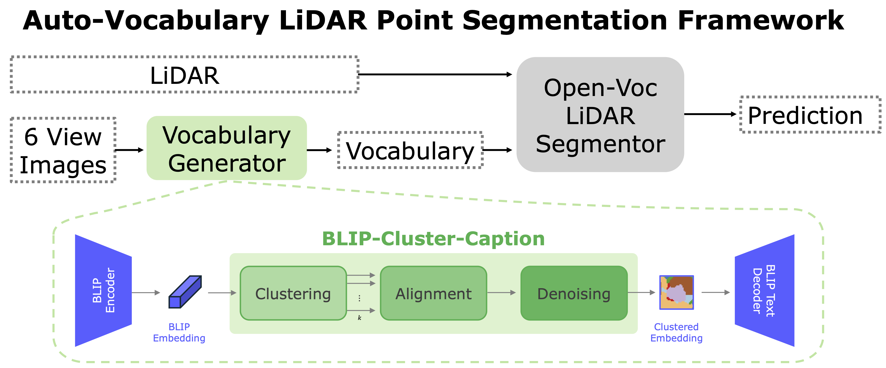

# AutoVoc3D: Auto-Vocabulary Segmentation for LiDAR Points
This repository contains the code of the paper [Auto-Vocabulary Segmentation for LiDAR Points](https://arxiv.org/abs/2406.09126) by Weijie Wei, Osman Ülger, Fatemeh Karimi Najadasl, Theo Gevers and Martin R. Oswald.

<p align="center">
  
</p>

## Code Release
Coming soon upon publication.

## Cite
```

@misc{wei2024autovocabulary,
      title={Auto-Vocabulary Segmentation for LiDAR Points}, 
      author={Weijie Wei and Osman Ülger and Fatemeh Karimi Najadasl and Theo Gevers and Martin R. Oswald},
      year={2024},
      eprint={2406.09126},
      archivePrefix={arXiv}
}